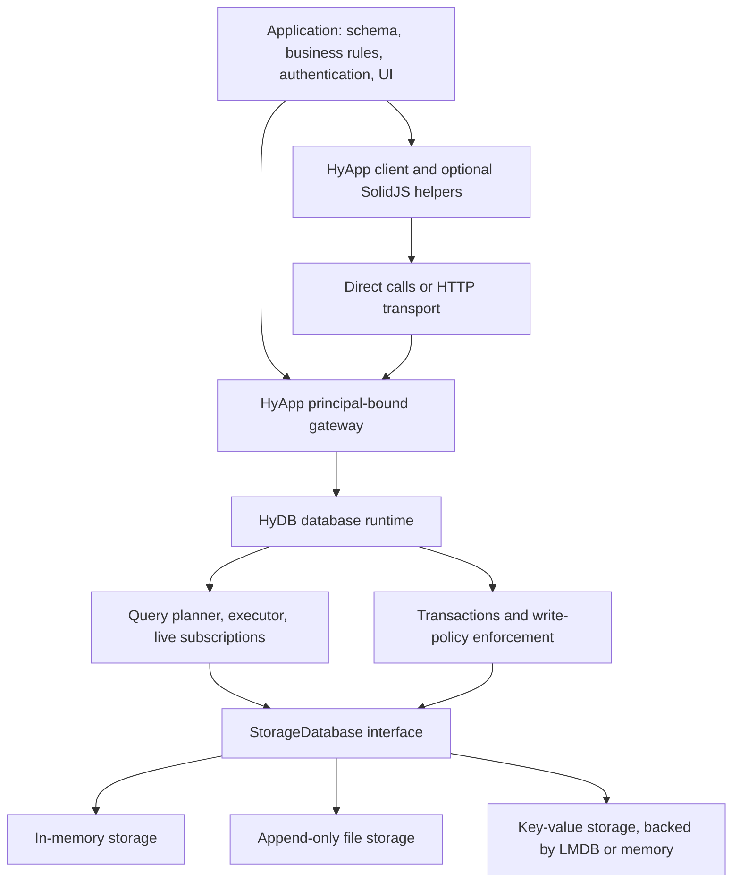
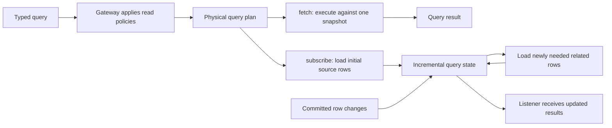
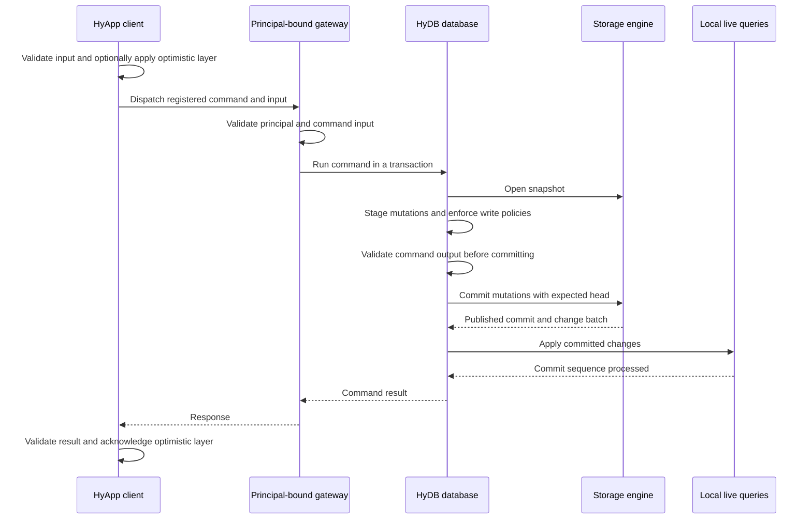
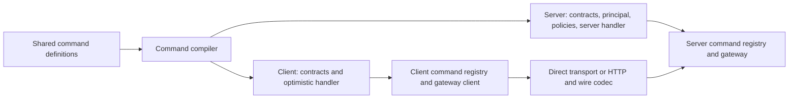
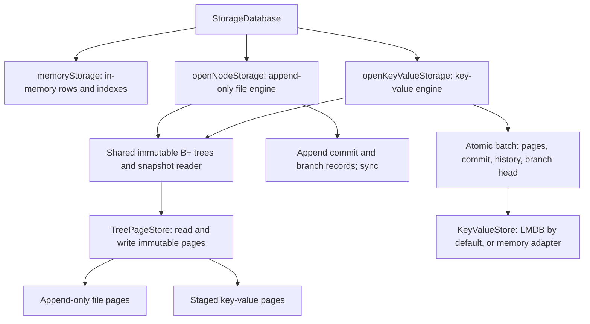
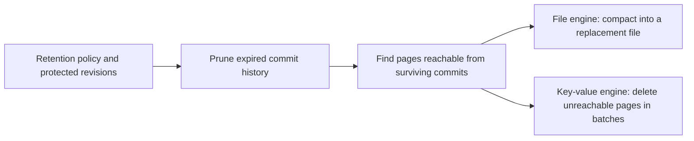

# Architecture

HyDB is the database engine. HyApp builds an application API around it: typed
commands, authorization, client/server compilation, and transports. Applications
supply their schema, business rules, authentication, and UI.

This document describes the implementation in this repository. The dependency
runs one way: `@hyos/hyapp` depends on `@hyos/hydb`.

## The overall shape

The gateway is the application authorization boundary. Trusted code can also use
HyDB directly. Node-specific persistence lives in `@hyos/hydb/node`; HTTP server
integration lives in `@hyos/hyapp/node`. SolidJS is optional.

| Component | Responsibility | Where to start |
| --- | --- | --- |
| Schema and query builders | Define tables, columns, keys, indexes, and typed query descriptions. | [schema.ts](packages/hydb/src/schema.ts), [query.ts](packages/hydb/src/query.ts) |
| Database runtime | Own the write queue, snapshots, subscriptions, change-stream consumption, and shutdown. | [database.ts](packages/hydb/src/database.ts) |
| Policy primitives | Restrict reads and validate writes against the authenticated principal. | [read-policy.ts](packages/hydb/src/read-policy.ts), [write-policy.ts](packages/hydb/src/write-policy.ts) |
| Application commands and gateway | Validate command contracts and run business logic inside authorized transactions. | [command.ts](packages/hyapp/src/command.ts), [gateway.ts](packages/hyapp/src/gateway.ts) |
| Client integration | Dispatch commands, fetch and subscribe to queries, and expose reactive UI state. | [gateway-client.ts](packages/hyapp/src/gateway-client.ts), [solid.ts](packages/hyapp/src/solid.ts) |

## Reads and live queries

A query is a typed description of the desired rows, filters, ordering, and nested
selections. The gateway first applies read policies for its principal. The
planner then chooses table scans, primary-key lookups, or secondary-index scans,
and indexed-loop or hash joins where appropriate.

`fetch` opens a consistent storage snapshot, executes the plan, and closes the
snapshot. `subscribe` builds a [SubscriptionRuntime](packages/hydb/src/subscription.ts)
from an initial snapshot and buffers commits arriving during initialization.
It loads indexed scopes and related rows on demand; unsupported access patterns
fall back to broader scans.

[The incremental dataflow engine](packages/hydb/src/dataflow.ts) maintains query
state from committed before/after row changes. Those changes are internal:
listeners receive query results, rather than raw storage mutations.

The [memory manager](packages/hydb/src/memory.ts) tracks owned allocations,
reclaims eligible state, and supports hard reservations. Optional
[spill storage](packages/hydb/src/spill.ts) lets sorting, hash joins, and live-query
arrangements move intermediate state out of memory. This is accounting for
managed state, not a cap on the entire process's memory usage.

Sources: [planner](packages/hydb/src/planner.ts),
[executor](packages/hydb/src/executor.ts),
[subscription runtime](packages/hydb/src/subscription.ts).

## Commands and transactions

Commands pair input/output schemas with business logic. A gateway session binds
them to a validated principal. Authentication itself belongs to the application;
the gateway receives the resulting principal context.

Writes are serialized within a database instance. Transactions stage changes
against a snapshot; storage checks `expectedHead` before publishing, so a stale
writer cannot silently overwrite a newer commit. Input, policy, or output
validation failures abort before publication. A successful write waits for the
local subscription machinery to process its commit sequence before returning;
this does not wait for a remote browser to render.

Optimistic behavior is optional. Applications provide an `OptimisticCoordinator`
to create layers and handle acknowledgement or rejection. HyApp calls that
interface; it does not supply a complete offline replication or reconciliation
engine. A server handler can explicitly reuse the optimistic mutation logic once,
or that logic becomes the server implementation when no server handler is given.

Sources: [command execution](packages/hyapp/src/command.ts),
[client dispatch](packages/hyapp/src/gateway-client.ts),
[transaction implementation](packages/hydb/src/command.ts).

## Client/server compilation and transport

A shared command definition can contain both server behavior and optimistic
client behavior. The command compiler produces a separate version for each target.

For client builds, the compiler removes server handlers, principal/policy factory
arguments, and dependencies left unused by that removal. It rejects command
shapes it cannot safely analyze. The esbuild adapter performs this transformation
before dependency resolution. The gateway client rejects uncompiled server commands.

The HTTP adapter maps registered query names to reads and streaming subscriptions,
and registered command names to dispatch. It uses JSON responses and newline-delimited
JSON subscription messages. The shared wire codec preserves values plain JSON
would lose, including dates, byte arrays, bigints, and `undefined`. HTTP requests
refer to the shared read registry rather than sending executable query definitions.

Solid helpers own query loading/error state, subscription cleanup, and reactive
per-command pending state. Direct transport provides the same client interface
for an in-process gateway session.

Sources: [compiler](packages/hyapp/src/compiler.ts),
[esbuild adapter](packages/hyapp/src/esbuild.ts),
[HTTP client](packages/hyapp/src/http.ts),
[HTTP server](packages/hyapp/src/node/http.ts),
[wire codec](packages/hyapp/src/wire.ts).

## Storage and durability

All engines implement [StorageDatabase](packages/hydb/src/storage.ts): snapshots,
commits, branch heads, change streams, retention roots, and garbage collection.
A commit ID identifies a revision; a branch sequence orders changes on a branch.

The persistent engines share tree algorithms, row/index mutation logic, and
snapshot reads. Updating a B+ tree writes new pages and reuses unchanged ones,
so existing snapshots retain their original roots. `TreePageStore` manages page
access; the enclosing storage engine owns atomic publication and durability.

The file engine uses append-only records and startup checkpoints to reduce replay
work. The key-value engine stages new pages, then publishes pages and metadata in
one conditional atomic batch. Its LMDB adapter waits for durable completion before
advancing public heads or notifying readers. An uncertain publication failure
requires closing and reopening the key-value engine.

Sources: [file engine](packages/hydb/src/node/node-storage.ts),
[key-value engine](packages/hydb/src/node/key-value-storage.ts),
[B+ trees](packages/hydb/src/node/bplus-tree.ts),
[page interface](packages/hydb/src/node/tree-page-store.ts),
[shared snapshot reader](packages/hydb/src/node/tree-snapshot.ts).

## Retention, migrations, and cleanup

Persistent storage defaults to retaining history forever. A retention window can
keep recent commits by count or age. Branch heads/bases, named retains, open
snapshots, and unread change-stream history protect revisions from collection.
Garbage collection is explicitly requested by the caller.

The key-value collector yields between batches, but still scans history/pages
and tracks live page IDs. Its reader protection is local to the storage instance;
use one active instance per database during collection. Reclaimed LMDB pages can
be reused without immediately shrinking the database file.

| Operation | Current support |
| --- | --- |
| Schema migration | The file engine applies ordered declarative schema/data steps, committing progress so reopening can resume after interruption. The migration CLI supports schema diffing, chain validation, and file generation. |
| Key-value schema changes | General schema migration is not supported; reopening requires the same schema. |
| File-to-LMDB import | The offline importer copies published history into a new destination, verifies stored records and query results, and only then publishes metadata. It preserves the source. |
| Cleanup | Close snapshots and unsubscribe when finished. `database.close()` stops change consumption, disposes subscriptions, and closes its storage. |

Sources: [migration API](packages/hydb/src/node/migration.ts),
[migration CLI](packages/hydb/scripts/migration-cli.mjs),
[key-value behavior and limits](packages/hydb/KEY_VALUE_PROTOTYPE.md),
[offline import](packages/hydb/FILE_IMPORT.md).

Legacy `hydb.command` and `hydb.gateway` APIs remain for compatibility. New
application composition belongs in HyApp; see its [usage guide](packages/hyapp/usage.md).
