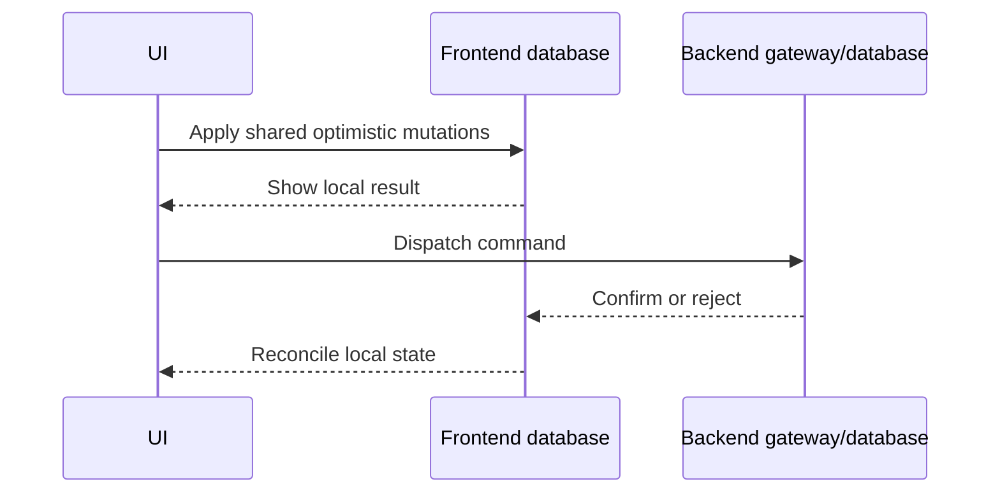

# Application API

[Usage reference](../../usage.md) · [Database](database.md) · [Export index](exports.md)

Use HyApp for new applications. The examples use `model.ts` from the
[shared model](database.md#example-model); they form separate modules.

## Authorization

A principal is authenticated application identity validated by a Zod schema.
HyApp does not authenticate cookies/tokens for you. Reuse the **same schema
object** for the gateway, command factory, and all policies. Each policy set
must cover every table exactly once, using the actual schema's table objects.
Missing/duplicate policies or mismatched principal schemas reject construction.

```ts
// policies.ts
import { hydb } from "@hyos/hydb";
import { z } from "zod";
import { projects, tasks } from "./model.js";

export const principal = z.object({ userId: z.string() });
const read = hydb.readPolicy(principal);
const write = hydb.writePolicy(principal);

export const readPolicies = [
  read.where(projects, ({ row, principal }) => row.ownerId.eq(principal.userId)),
  read.through(tasks, projects, { from: tasks.projectId, to: projects.id }),
];

export const writePolicies = [
  write.where(projects, ({ change, principal }) => {
    if (change.kind === "insert") return change.after.ownerId === principal.userId;
    if (change.kind === "delete") return change.before.ownerId === principal.userId;
    return change.before.ownerId === principal.userId
      && change.after.ownerId === principal.userId;
  }),
  write.through(tasks, projects, { from: tasks.projectId, to: projects.id }),
];
```

| Builder | Methods and semantics |
| --- | --- |
| `hydb.readPolicy(principalSchema)` | `.where(table, ({ row, principal }) => expression)` returns a query expression, not a JS boolean. `.through(child, parent, { from, to })` restricts children to readable parents. `.allowAll(table)` and `.denyAll(table)` are explicit policies. |
| `hydb.writePolicy(principalSchema)` / `writePolicy(principalSchema)` | `.where(table, ({ change, principal, db }) => booleanOrPromise)` authorizes a mutation. `.through(...)`, `.allowAll(...)`, and `.denyAll(...)` complete the builder. |

`WriteChange<Row>` discriminates on `kind`: insert has `after`, update has
`before` and `after`, delete has `before`. Check both sides of updates to prevent
ownership transfer. `db` is a `TransactionReader` with `get(table, key)`; its reads
are trusted and do not apply read policies.

Through policies require a single-column primary key on the parent. A write
checks the parent for each relevant before/after relationship; missing or null
parents deny. The parent write policy receives a synthetic update with the same
parent row before and after. Cyclic through-policy chains reject.

For a deliberate override, inside a server transaction use
`await transaction.withAdminPolicy(async ({ db, assert }) => { ... })`.
Read evidence with `db.get`, call `assert(condition, "non-empty reason")`, then
perform writes with the enclosing `transaction`. At least one successful
assertion must precede writes; a failed assertion rejects the transaction. The
override lasts for that callback. Await it before unrelated writes on the same
transaction; do not overlap admin scopes or concurrent transaction work.

Low-level adapters can call:

- `createReadPolicyEnforcer(schema, principalSchema, policies).authorize(query, principal)`
  to produce a filtered query.
- `createWritePolicyEnforcer(schema, principalSchema, policies).authorize(table, change, principal, db)`
  to await authorization; denial throws `AuthorizationError`.
- `getWritePolicyPrincipalSchema(policy)` to inspect its principal schema identity.

These enforce authorization; they do not verify a user's identity. Direct
`database.fetch` and storage access bypass gateway read filtering.

Sources: [read policies](../../packages/hydb/src/read-policy.ts),
[write policies](../../packages/hydb/src/write-policy.ts).

## Commands and contracts

```ts
// commands.ts — compile this module for the appropriate target
import { commandFactory, commandRegistry } from "@hyos/hyapp";
import { z } from "zod";
import { projects, tasks } from "./model.js";
import { principal, writePolicies } from "./policies.js";

const command = commandFactory({ principal, defaultPolicy: writePolicies });

export const registry = commandRegistry({
  createProject: command.define({
    input: z.object({ id: z.string(), name: z.string().min(1) }),
    server: async ({ transaction, principal }, input) => {
      await transaction.insert(projects, { ...input, ownerId: principal.userId });
    },
  }),
  createTask: command.define({
    input: z.object({
      id: z.string(), projectId: z.string(),
      title: z.string().min(1), createdAt: z.date(),
    }),
    optimistic: async ({ transaction }, input) => {
      await transaction.insert(tasks, input);
    },
  }),
  completeTask: command.define({
    input: z.object({ id: z.string() }),
    optimistic: async ({ transaction }, { id }) => {
      await transaction.update(tasks, [id], { done: true });
    },
    server: async ({ applyOptimistic }) => {
      await applyOptimistic();
    },
  }),
});
```

`commandFactory` is an alias for `createServerCommandFactory`. Both take
`{ principal, defaultPolicy }` and return a `ServerCommandFactory` with `.define`.
The `hyapp` namespace also exposes these factories, `createClientCommandFactory`,
`commandRegistry`, `gatewayReadRegistry`, `gateway`, and `gatewayClient`.

| Definition field | Contract |
| --- | --- |
| `input` | Zod schema; asynchronous parsing/transforms run before the handler. |
| `output` | Optional Zod schema for the result. Without it the result is `void`. With it a server handler is required; its result is validated before commit. |
| `optimistic({ transaction }, parsedInput)` | Reusable mutations; return void/Promise. The `MutationTransaction` only has `insert`, `update`, `delete`. |
| `server({ transaction, principal, applyOptimistic }, parsedInput)` | Authoritative handler with full `Transaction`. Return the declared output. |

At least one handler is required. Without an explicit server handler, the server
runs the optimistic handler. With a server handler, shared mutations run only
when it calls `applyOptimistic()`; calling it twice rejects. Put IDs and timestamps
in the input when both databases must apply identical values. Do not generate
separate random IDs in the two executions.

`InferCommandInput<typeof command>` describes caller input; `InferCommandResult`
describes validated output. `ServerCommand`, `ClientCommand`, `AnyCommand`,
`AnyServerCommand`, and `AnyClientCommand` distinguish targets. A server command
cannot be passed to `gatewayClient`, even if it has an optimistic handler.

For explicit client definitions without a compiler, use
`createClientCommandFactory().define({ input, output?, optimistic? })`, or create
`const contract = createCommandContract({ input, output? })` and call
`.define({ contract, optimistic? })`. Share those input/output schemas with the
server definition. Server factories take schemas, not a `contract` option.
`ClientCommandFactory` and `CommandContract` describe these values.

Custom integrations can use these lower-level functions:

| Function | Behavior |
| --- | --- |
| `executeServerCommand(database, command, input, principal)` | Validates, executes with policies, validates output, commits, and returns the result. |
| `executeOptimisticCommand(clientCommand, input, transaction)` | Validates input and applies shared mutations; no handler means no mutations. Does not create a local transaction or reconciliation layer. |
| `parseCommandInput(clientCommand, input)` | Returns parsed input. |
| `parseCommandResult(command, value)` | Returns validated/transformed output. |

Source: [command.ts](../../packages/hyapp/src/command.ts).

## Registries and gateways

`commandRegistry({ name: command })` and `gatewayReadRegistry({ name: query })`
freeze copies preserving literal names and types. Names form the HTTP protocol;
keep browser and server registries aligned. `RegistryCommandName`,
`RegistryCommandInput`, and `RegistryCommandResult` derive types from a registry.
`CommandRegistry` accepts client/server commands; `ServerCommandRegistry` only
server commands. `GatewayReadRegistry` contains terminal query objects.

```ts
// gateway.ts
import type { Database } from "@hyos/hydb";
import { gateway, gatewayReadRegistry } from "@hyos/hyapp";
import { registry } from "./commands.js";
import { taskList } from "./model.js";
import { principal, readPolicies } from "./policies.js";

export const reads = gatewayReadRegistry({ tasks: taskList });
export const createGateway = (database: Database) => gateway({
  database, principal, registry, readPolicies,
});
```

`gateway({ database, principal, registry, readPolicies })` exposes `.registry`
and `.forPrincipal(value)`. The latter validates the principal and creates a
`GatewaySession` with `fetch(query)`, `subscribe(query, listener)`, and
`dispatch(name, input)`. Fetch/dispatch return promises; subscribe returns a
synchronous disposer. Both root and nested reads are authorized. Sessions do not
own the database. Types `Gateway`, `GatewayCommands`, and `InferGatewayCommands`
are available from HyApp; do not confuse them with legacy HyDB equivalents.

`gatewayClient({ registry, transport, optimistic?, createInvocationId? })` has
`.registry`, `.fetch`, `.subscribe(query, listener, onError?)`, and `.dispatch`.
It requires **client-target** commands. Invocation IDs default to
`crypto.randomUUID()`. For in-process tests, `directGatewayTransport(session)`
implements the transport interface against a trusted server session.

A custom `GatewayClientTransport` implements `fetch(query): Promise<unknown>`,
`subscribe(query, listener, onError?): () => void`, and
`dispatch(request): Promise<GatewayCommandResponse>`. A request contains
`{ invocationId, command, input }`; a response has `{ result, watermark? }`.
Built-in transports return results without populating a replication watermark.

## Optimistic lifecycle



The application supplies `OptimisticCoordinator.begin(request)`, returning an
`OptimisticLayer` (or promise) with `transaction`, `applied()`,
`acknowledged(response)`, and `rejected(error)`. Lifecycle methods can be async.
For a command with optimistic logic, the client begins a layer, validates/runs
its mutations, awaits `applied`, dispatches, validates the returned result, and
awaits `acknowledged`. Mutation, validation, and dispatch failures reject the layer; if rejection itself fails, the
client throws `AggregateError` containing both errors. An error from
`acknowledged` propagates without automatically invoking `rejected`: the server
may already have committed, so the coordinator must recover that state.

A coordinator must manage visibility, pending layers, rollback, and reconciliation
with authoritative data. The framework does not provide a ready-made replicated
frontend database or automatically merge local reads into HTTP results:
`client.fetch/subscribe` delegate to the transport. Supply local read integration
as part of your application's transport/database wiring. Invocation IDs alone do
not provide server deduplication, retry, offline persistence, or exactly-once
execution. Test overlapping commands and live results arriving before responses.

Source: [gateway-client.ts](../../packages/hyapp/src/gateway-client.ts).

## HTTP server and browser transport

```ts
// http.ts — supply an application authentication resolver
import { createServer, type IncomingMessage } from "node:http";
import type { Database } from "@hyos/hydb";
import { createNodeGatewayHttpHandler } from "@hyos/hyapp/node";
import { createGateway, reads } from "./gateway.js";

export function createHttpServer(
  database: Database,
  authenticate: (request: IncomingMessage) => Promise<{ userId: string }>,
) {
  const handle = createNodeGatewayHttpHandler({
    gateway: createGateway(database), reads, principal: authenticate,
  });
  return createServer((request, response) => {
    void handle(request, response).then((handled) => {
      if (!handled) { response.statusCode = 404; response.end(); }
    }).catch(() => { response.statusCode = 500; response.end(); });
  });
}
```

`createNodeGatewayHttpHandler` returns a `NodeGatewayHttpHandler`, an async
`(request, response) => boolean`: false means the route was not handled. Options:
`gateway`, `reads`, `principal(request)`, `basePath` (default `/api/hyapp`),
`maxBodyBytes` (default 65,536), and `onError(error, request)`. Authenticate in the
principal resolver; do not trust a user ID supplied by an unauthenticated caller.
Close the HTTP server/subscriptions and await `database.close()` on shutdown.

Routes under the base path are `GET /reads/:name`,
`GET /subscriptions/:name` (newline-delimited wire JSON), and
`POST /commands/:name`. Disconnecting a subscription disposes its server listener.
This adapter does not add CORS, an auth provider, or application routing.

In the browser, create
`httpGatewayTransport({ reads, baseUrl?, headers?, onSubscriptionError? })`.
`baseUrl` defaults to `/api/hyapp`; `headers` is a callback returning a string
record. The query passed to fetch/subscribe must be the **same object** registered
in `reads`; a separately constructed equivalent query is not registered.
`GatewayHttpError` exposes `status`; subscription errors use the callback.
`GatewaySubscriptionMessage` is `{ type: "data", value }` or
`{ type: "error", error: string }`. Keep transport failures visible in the UI.

Sources: [HTTP client](../../packages/hyapp/src/http.ts),
[Node handler](../../packages/hyapp/src/node/http.ts).

## SolidJS

This module expects the browser build to compile `commands.ts` for the client.
It defines its read registry locally, so it never imports the server gateway.

```tsx
// TaskList.tsx
import { createSignal, For, Show } from "solid-js";
import { gatewayClient, gatewayReadRegistry } from "@hyos/hyapp";
import { httpGatewayTransport } from "@hyos/hyapp/http";
import { createCommandDispatcher, createGatewayQuery } from "@hyos/hyapp/solid";
import { registry } from "./commands.js";
import { taskList } from "./model.js";

const reads = gatewayReadRegistry({ tasks: taskList });
const client = gatewayClient({ registry, transport: httpGatewayTransport({ reads }) });

export function TaskList() {
  const query = createGatewayQuery(client, taskList);
  const dispatch = createCommandDispatcher(client);
  const [error, setError] = createSignal<unknown>();

  const complete = async (id: string) => {
    try { await dispatch("completeTask", { id }); }
    catch (cause) { setError(cause); }
  };

  return <>
    <Show when={query.loading()}>Loading…</Show>
    <Show when={query.error() || error()}>Could not load or update tasks.</Show>
    <For each={query.data() ?? []}>{(task) =>
      <button disabled={task.done || dispatch.isPending("completeTask")}
        onClick={() => void complete(task.id)}>
        {task.title}{task.done ? " ✓" : ""}
      </button>
    }</For>
  </>;
}
```

`createGatewayQuery(clientOrAccessor, queryOrAccessor)` returns
`GatewayQueryState`: `data()` starts undefined, `loading()`, `error()`, and
`refetch()`. It fetches, subscribes, and resubscribes when accessor inputs change.
Create it under a Solid owner (normally a component); disposal stops subscriptions.
`GatewaySource<Value>` is a value or Solid accessor.

`createCommandDispatcher(clientOrAccessor)` returns a callable
`CommandDispatcher`; `dispatch(name, input)` returns the command promise and
`.isPending(name)` is reactive. It counts overlapping dispatches for a command
name, not per row. This example uses authoritative live reads; adding optimistic
handlers alone does not install a frontend database/coordinator.

## Compile shared commands

`compileCommandModule(source, { target: "client" | "server", filename? })` from
`@hyos/hyapp/compiler` returns `CompiledCommandModule` with `code` and `map`.
`CommandCompilationTarget` names the target union. The client transform recognizes
imported `commandFactory`/`hyapp.commandFactory`, removes server handlers and
factory policy arguments, and removes dependencies made unused by that removal.
Keep `.define` definitions statically analyzable inline object literals; do not
hide server properties in spreads/computed definitions. Review the resulting
bundle for server-only imports; the transform is not a general secret scrubber.

`hyappCommandsPlugin({ target })` from `@hyos/hyapp/esbuild` supplies an esbuild
plugin. Run command compilation before the application's Solid JSX transform.
When composing loaders, ensure the same module receives both transforms; esbuild
stops at the first `onLoad` result, so competing plugins may not compose on their
own. Other bundlers can call `compileCommandModule` in a pre-transform hook.
See the [HyApp build integration guide](../../packages/hyapp/usage.md).

## Wire values

From `@hyos/hyapp/wire`, `encodeWireValue(value)` produces JSON-compatible
`WireValue`, and `decodeWireValue(value)` restores typed values.
`stringifyWire(value)` and `parseWire(text)` combine these operations with JSON.
The HTTP adapters already use them; plain `JSON.stringify` loses some types.

The codec handles objects/arrays, primitives, `undefined`, `Date`, `Uint8Array`,
`bigint`, `NaN`, infinities, and negative zero using tagged values. Reserved
`$hyapp` object keys are escaped. Functions, symbols, invalid dates, and malformed
tags reject. This is not a cyclic graph or arbitrary class-instance serializer.
The [persistent row codec](storage.md#stored-values) supports fewer value types.
